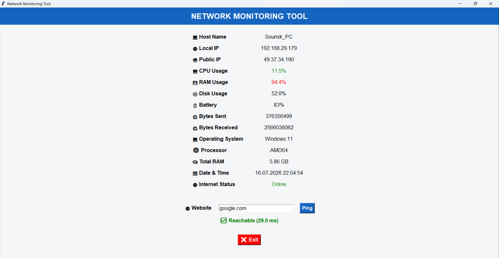

# Network Monitoring Tool

A Python Tkinter-based GUI application that monitors system and network information in real time.

## Application Preview



## Features

- Host Name
- Local IP Address
- Public IP Address
- CPU Usage
- RAM Usage
- Disk Usage
- Battery Status
- Bytes Sent & Received
- Operating System
- Processor
- Total RAM
- Date & Time
- Internet Status
- Website Ping Test

## Technologies Used

- Python
- Tkinter
- Psutil
- Requests
- Socket
- Platform

## Installation

```bash
pip install -r requirements.txt
```

## Run

```bash
python main.py
```

## Author

Soumik Chakraborty
